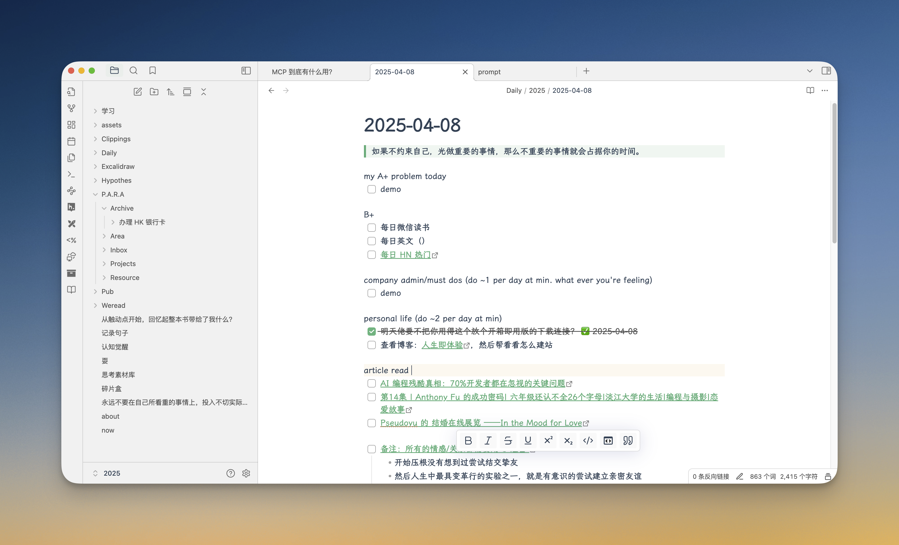

这是我个人的 [Obsidian](https://obsidian.md/) vault 模板。我也还是一个 Obsidian 使用的初学者，有很多东西我都在探索中。

比如一些类型模板还未创建（会随时更新的）：
- [ ] 出去游玩的攻略模板 
- [ ] .......

整个笔记库将以 [ P.A.R.A 理论](https://book.douban.com/subject/36636224/) 为核心向外延展，`选择你喜欢的模板或者插件即可，它绝非教条，只是我如何使用 Obsidan 的一个例子。`

**一些简单上手使用 Obsidian 的经验分享：**
1. [Obsidian 配置篇 - 未央花博客](https://www.pslanys.com/archives/obsidian-setting.html) (本人写的)
2. [我的 Obsidian 使用经验 \| CatCoding](https://catcoding.me/p/obsidian-for-programmer/) （引导我最开始使用 Obsidian 的文章）
3. [How I use Obsidian — Steph Ango](https://stephango.com/vault)（Obsidian CEO，很喜欢他对笔记软件的理念）
4. [我如何使用Apple Notes做笔记](https://lutaonan.com/blog/apple-notes-and-para/)（我了解到 PARA 的来源，也是我实践的地方）
5. [Obsidian CEO 的 vault 模板](https://github.com/kepano/kepano-obsidian)

## 效果图

## 开始使用

1. [Download this vault](https://github.com/Emt-lin/wyh-obsidian/archive/refs/heads/main.zip)
2. 解压 .zip 文件至您选择的文件夹
3. 打开 Obsidian 并创建一个指向该文件夹的新库

